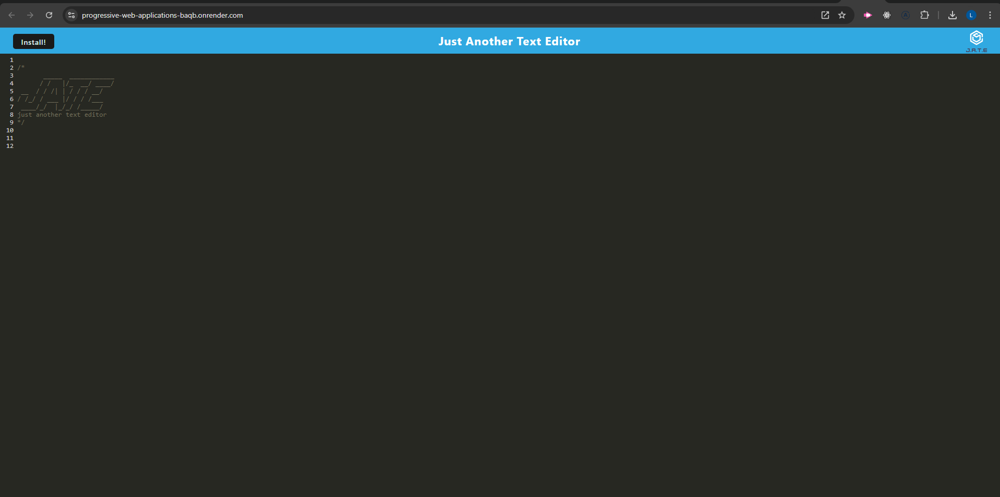
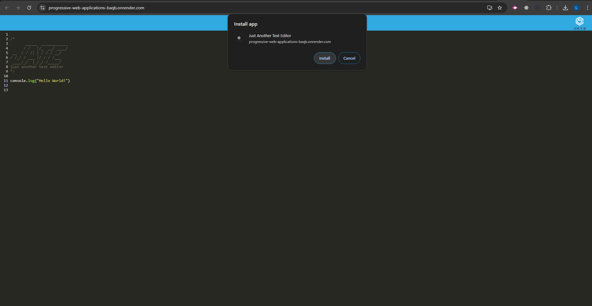
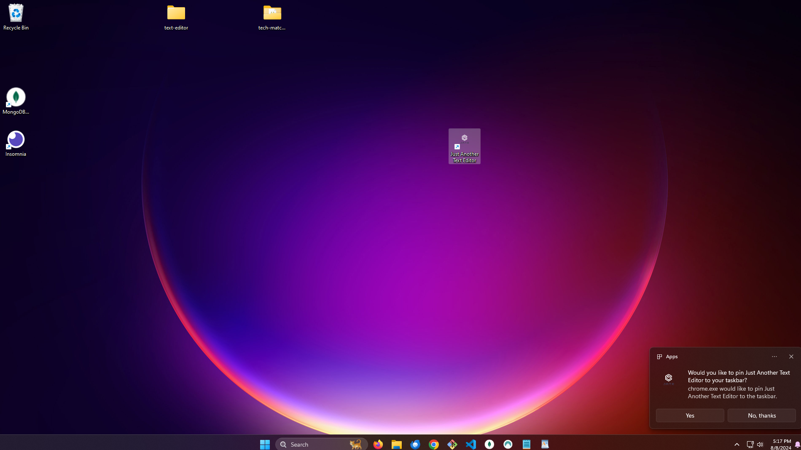

# Progressive Web Application Text Editor

## Description

This application is a text editor that runs in the browser and also functions offline

## Installation

First, clone the repository from GitHub at: https://github.com/LisaLReynolds/progressive-web-applications. Once it has been cloned, run `npm i && npm run dev` in order to install the dependencies concurrently in all the package.jsons as well as to start your server. 

## Usage

Navigate to https://progressive-web-applications-baqb.onrender.com in your browser. Once there you may begin using the text editor right away or install it first. To install click on the "Install!" button on the upper left of the webpage. You will be presented with a modal, click "install" once more. This will install the text editor on your computer where an icon will appear on your desktop. Simply open the text editor to find your text and continue using it. 

